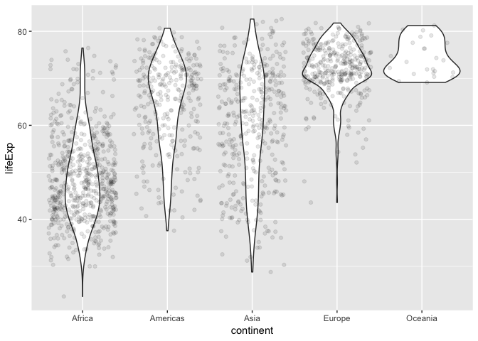
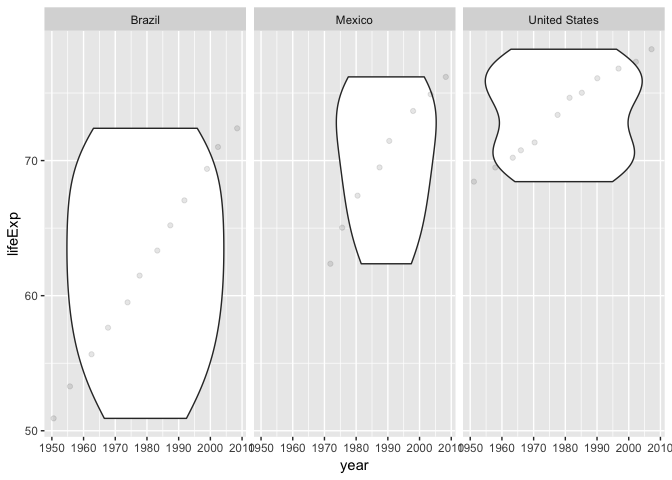

## Overview

The goal is to explore a dataset. In particular, to begin to establish a workflow for data frames or “tibbles”. This homework will use dplyr and ggplot2 to do some description and visualization.

## library the data set

```r
library(gapminder)
library(tidyverse)
```

```
## -- Attaching packages ---------------------------- tidyverse 1.2.1 --
```

```
## <U+221A> ggplot2 3.0.0     <U+221A> purrr   0.2.5
## <U+221A> tibble  1.4.2     <U+221A> dplyr   0.7.6
## <U+221A> tidyr   0.8.1     <U+221A> stringr 1.3.1
## <U+221A> readr   1.1.1     <U+221A> forcats 0.3.0
```

```
## -- Conflicts ------------------------------- tidyverse_conflicts() --
## x dplyr::filter() masks stats::filter()
## x dplyr::lag()    masks stats::lag()
```

## Explore the gapminder object:
1. Is it a data.frame, a matrix, a vector, a list?

```r
class(gapminder)
```

```
## [1] "tbl_df"     "tbl"        "data.frame"
```
Answer: The object of gapminder is a "data.frame". 

2. What is its class?

```r
class(gapminder)
```

```
## [1] "tbl_df"     "tbl"        "data.frame"
```
Answer: The class of gapminder is a "tbl_df". 

3,4. How many variables/columns and rows/observations?

```r
ncol(gapminder)
```

```
## [1] 6
```

```r
nrow(gapminder)
```

```
## [1] 1704
```
Answer: There are 6 colums and 1704 rows. 

5. Can you get these facts about “extent” or “size” in more than one way? Can you imagine different functions being useful in different contexts?

```r
str(gapminder)
```

```
## Classes 'tbl_df', 'tbl' and 'data.frame':	1704 obs. of  6 variables:
##  $ country  : Factor w/ 142 levels "Afghanistan",..: 1 1 1 1 1 1 1 1 1 1 ...
##  $ continent: Factor w/ 5 levels "Africa","Americas",..: 3 3 3 3 3 3 3 3 3 3 ...
##  $ year     : int  1952 1957 1962 1967 1972 1977 1982 1987 1992 1997 ...
##  $ lifeExp  : num  28.8 30.3 32 34 36.1 ...
##  $ pop      : int  8425333 9240934 10267083 11537966 13079460 14880372 12881816 13867957 16317921 22227415 ...
##  $ gdpPercap: num  779 821 853 836 740 ...
```

```r
glimpse(gapminder)
```

```
## Observations: 1,704
## Variables: 6
## $ country   <fct> Afghanistan, Afghanistan, Afghanistan, Afghanistan, ...
## $ continent <fct> Asia, Asia, Asia, Asia, Asia, Asia, Asia, Asia, Asia...
## $ year      <int> 1952, 1957, 1962, 1967, 1972, 1977, 1982, 1987, 1992...
## $ lifeExp   <dbl> 28.801, 30.332, 31.997, 34.020, 36.088, 38.438, 39.8...
## $ pop       <int> 8425333, 9240934, 10267083, 11537966, 13079460, 1488...
## $ gdpPercap <dbl> 779.4453, 820.8530, 853.1007, 836.1971, 739.9811, 78...
```

```r
summary(gapminder)
```

```
##         country        continent        year         lifeExp     
##  Afghanistan:  12   Africa  :624   Min.   :1952   Min.   :23.60  
##  Albania    :  12   Americas:300   1st Qu.:1966   1st Qu.:48.20  
##  Algeria    :  12   Asia    :396   Median :1980   Median :60.71  
##  Angola     :  12   Europe  :360   Mean   :1980   Mean   :59.47  
##  Argentina  :  12   Oceania : 24   3rd Qu.:1993   3rd Qu.:70.85  
##  Australia  :  12                  Max.   :2007   Max.   :82.60  
##  (Other)    :1632                                                
##       pop              gdpPercap       
##  Min.   :6.001e+04   Min.   :   241.2  
##  1st Qu.:2.794e+06   1st Qu.:  1202.1  
##  Median :7.024e+06   Median :  3531.8  
##  Mean   :2.960e+07   Mean   :  7215.3  
##  3rd Qu.:1.959e+07   3rd Qu.:  9325.5  
##  Max.   :1.319e+09   Max.   :113523.1  
## 
```

```r
ls(gapminder)
```

```
## [1] "continent" "country"   "gdpPercap" "lifeExp"   "pop"       "year"
```
Answer: "str"" function can get these facts, such as classes, objects, variables.  Similarly, "glimpse"" can return the details of dataset while this method tries to show you as much data as possible. Another userful function is "summary"", which returns the values such as median, mean, max of the each variable. Function "ls"" is also useful in returning the variables.

6. What data type is each variable?
Answer: according to results of questions 5, the data of each variable is shown as below:
$ country   <fct> 
$ continent <fct> 
$ year      <int> 
$ lifeExp   <dbl> 
$ pop       <int> 
$ gdpPercap <dbl>

## Explore individual variables
1. What are possible values (or range, whichever is appropriate) of each variable?

```r
## let's make a data frame containing the columns year, pop, continent from the gapminder dat.
select(gapminder,year,pop, continent) %>% 
  arrange(year, pop) %>% # Then order by year, then by pop
  filter(pop > 1000000000 & year >= 2002) # Then fliter the data with population more than 1 billion and year more than 2002
```

```
## # A tibble: 4 x 3
##    year        pop continent
##   <int>      <int> <fct>    
## 1  2002 1034172547 Asia     
## 2  2002 1280400000 Asia     
## 3  2007 1110396331 Asia     
## 4  2007 1318683096 Asia
```

2. What values are typical? What’s the spread? What’s the distribution? Etc., tailored to the variable at hand.

```r
##scale can be viewed use bar chart
  ggplot(gapminder,aes(x = continent)) + 
  geom_bar() 
```

<!-- -->

```r
gapminder %>%
##distribution can be viewd use summary
  select(year, pop,continent, lifeExp) %>%
  summary()
```

```
##       year           pop               continent      lifeExp     
##  Min.   :1952   Min.   :6.001e+04   Africa  :624   Min.   :23.60  
##  1st Qu.:1966   1st Qu.:2.794e+06   Americas:300   1st Qu.:48.20  
##  Median :1980   Median :7.024e+06   Asia    :396   Median :60.71  
##  Mean   :1980   Mean   :2.960e+07   Europe  :360   Mean   :59.47  
##  3rd Qu.:1993   3rd Qu.:1.959e+07   Oceania : 24   3rd Qu.:70.85  
##  Max.   :2007   Max.   :1.319e+09                  Max.   :82.60
```

```r
##The counts for variables for each year are the same (142). This happens in country (12) as well
table(gapminder$year)
```

```
## 
## 1952 1957 1962 1967 1972 1977 1982 1987 1992 1997 2002 2007 
##  142  142  142  142  142  142  142  142  142  142  142  142
```

```r
table(gapminder$country)
```

```
## 
##              Afghanistan                  Albania                  Algeria 
##                       12                       12                       12 
##                   Angola                Argentina                Australia 
##                       12                       12                       12 
##                  Austria                  Bahrain               Bangladesh 
##                       12                       12                       12 
##                  Belgium                    Benin                  Bolivia 
##                       12                       12                       12 
##   Bosnia and Herzegovina                 Botswana                   Brazil 
##                       12                       12                       12 
##                 Bulgaria             Burkina Faso                  Burundi 
##                       12                       12                       12 
##                 Cambodia                 Cameroon                   Canada 
##                       12                       12                       12 
## Central African Republic                     Chad                    Chile 
##                       12                       12                       12 
##                    China                 Colombia                  Comoros 
##                       12                       12                       12 
##         Congo, Dem. Rep.              Congo, Rep.               Costa Rica 
##                       12                       12                       12 
##            Cote d'Ivoire                  Croatia                     Cuba 
##                       12                       12                       12 
##           Czech Republic                  Denmark                 Djibouti 
##                       12                       12                       12 
##       Dominican Republic                  Ecuador                    Egypt 
##                       12                       12                       12 
##              El Salvador        Equatorial Guinea                  Eritrea 
##                       12                       12                       12 
##                 Ethiopia                  Finland                   France 
##                       12                       12                       12 
##                    Gabon                   Gambia                  Germany 
##                       12                       12                       12 
##                    Ghana                   Greece                Guatemala 
##                       12                       12                       12 
##                   Guinea            Guinea-Bissau                    Haiti 
##                       12                       12                       12 
##                 Honduras         Hong Kong, China                  Hungary 
##                       12                       12                       12 
##                  Iceland                    India                Indonesia 
##                       12                       12                       12 
##                     Iran                     Iraq                  Ireland 
##                       12                       12                       12 
##                   Israel                    Italy                  Jamaica 
##                       12                       12                       12 
##                    Japan                   Jordan                    Kenya 
##                       12                       12                       12 
##         Korea, Dem. Rep.              Korea, Rep.                   Kuwait 
##                       12                       12                       12 
##                  Lebanon                  Lesotho                  Liberia 
##                       12                       12                       12 
##                    Libya               Madagascar                   Malawi 
##                       12                       12                       12 
##                 Malaysia                     Mali               Mauritania 
##                       12                       12                       12 
##                Mauritius                   Mexico                 Mongolia 
##                       12                       12                       12 
##               Montenegro                  Morocco               Mozambique 
##                       12                       12                       12 
##                  Myanmar                  Namibia                    Nepal 
##                       12                       12                       12 
##              Netherlands              New Zealand                Nicaragua 
##                       12                       12                       12 
##                    Niger                  Nigeria                   Norway 
##                       12                       12                       12 
##                     Oman                 Pakistan                   Panama 
##                       12                       12                       12 
##                 Paraguay                     Peru              Philippines 
##                       12                       12                       12 
##                   Poland                 Portugal              Puerto Rico 
##                       12                       12                       12 
##                  Reunion                  Romania                   Rwanda 
##                       12                       12                       12 
##    Sao Tome and Principe             Saudi Arabia                  Senegal 
##                       12                       12                       12 
##                   Serbia             Sierra Leone                Singapore 
##                       12                       12                       12 
##          Slovak Republic                 Slovenia                  Somalia 
##                       12                       12                       12 
##             South Africa                    Spain                Sri Lanka 
##                       12                       12                       12 
##                    Sudan                Swaziland                   Sweden 
##                       12                       12                       12 
##              Switzerland                    Syria                   Taiwan 
##                       12                       12                       12 
##                 Tanzania                 Thailand                     Togo 
##                       12                       12                       12 
##      Trinidad and Tobago                  Tunisia                   Turkey 
##                       12                       12                       12 
##                   Uganda           United Kingdom            United States 
##                       12                       12                       12 
##                  Uruguay                Venezuela                  Vietnam 
##                       12                       12                       12 
##       West Bank and Gaza              Yemen, Rep.                   Zambia 
##                       12                       12                       12 
##                 Zimbabwe 
##                       12
```

## Explore various plot types
Make a few plots, probably of the same variable you chose to characterize numerically. 
Let's see the relationship between life expectancy and continent

```r
PLOT <- ggplot(gapminder, aes(x=continent, y=lifeExp))
```

1. scatterplot

```r
  PLOT + geom_point() +
  ggtitle("Scatter plot of Life Expectancy")
```

<!-- -->
2. box plot

```r
 PLOT + geom_boxplot() +
    ggtitle("Scatter plot of Life Expectancy")
```

<!-- -->
3. violin plot

```r
 PLOT + geom_violin() +
    ggtitle("Scatter plot of Life Expectancy")
```

<!-- -->
4. overlap geom_violin and jitter plot

```r
 PLOT + geom_violin() +
  geom_jitter(alpha = 0.1)
```

<!-- -->
5. let's see the life expantancy in Americas with popolation more than 50 milion

```r
 gapminder %>% 
  filter(continent == "Americas") %>% 
  filter(pop >= 50000000) %>% 
  ggplot(aes(year, lifeExp, group = 1)) + 
  facet_grid(~country) +
  geom_violin() +
  geom_jitter(alpha = 0.1)
```

<!-- -->
6. let's compare lifeExp in Americas and in Asia with popolation more than 50 milion

```r
 gapminder %>% 
  filter(continent == "Americas" | continent == "Asia") %>% 
  filter(pop >= 50000000) %>% 
  ggplot(aes(year, lifeExp, group = 1)) + 
  facet_grid(~continent) +
  geom_violin() +
  geom_jitter(alpha = 0.1)
```

<!-- -->
